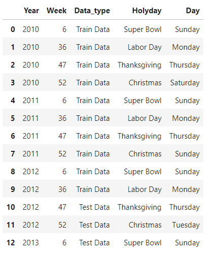
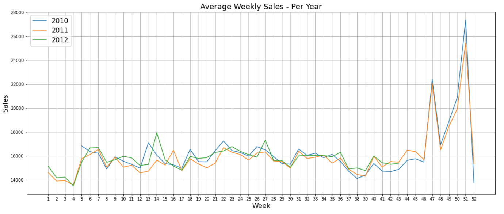

### WALMART-STORE-SALES-PREDICTIONS-Python

### OBJECTIVES:-

Data From Walmart Stores Accross The Us Is Given, And It Is Up To Us To Forecast Their Weekly Sales. The Data Is Already Split Into A Training And A Test Set, And We Want To Fit A Model To The Training Data That Is Able To Forecast Those Weeks Sales As Accurately As Possible. In Fact, Our Metric Of Interest Will Be The Mean Absolute Error.

### DATASET:-

[WALMART - STORE SALES FORECASTING](https://www.kaggle.com/avelinocaio/walmart-store-sales-forecasting/data)

This Is The Historical Sales Data For 45 Walmart Stores Located In Different Regions. Each Store Contains A Number Of Departments In Addition, Walmart Runs Several Promotional Markdown Events Throughout The Year. These Markdowns Precede Prominent Holidays, The Four Largest Of Which Are The Super Bowl, Labor Day, Thanksgiving, And Christmas. The Weeks Including These Holidays Are Weighted Five Times Higher In The Evaluation Than Non-Holiday Weeks.

Stores.csv:- This File Contains Anonymized Information About The 45 Stores, Indicating The Type And Size Of Store.

Train.csv:- This Is The Historical Training Data, Which Covers To 2010-02-05 To 2012-11-01. Within This File You Will Find The Following Fields:

- Store - The Store Number
- Dept - The Department Number
- Date - The Week
- Weekly_sales - Sales For The Given Department In The Given Store
- Isholiday - Whether The Week Is A Special Holiday Week

Test.csv:- This File Is Identical To Train.csv, Except We Have Withheld The Weekly Sales. You Must Predict The Sales For Each Triplet Of Store, Department, And Date In This File.

Features.csv:- This File Contains Additional Data Related To The Store, Department, And Regional Activity For The Given Dates. It Contains The Following Fields:

- Store - The Store Number
- Date - The Week
- Temperature - Average Temperature In The Region
- Fuel_price - Cost Of Fuel In The Region
- Markdown1-5 - Anonymized Data Related To Promotional Markdowns That Walmart Is Running. Markdown Data Is Only Available After Nov 2011, And Is Not Available For All Stores All The Time. Any Missing Value Is Marked With An Na.
- Cpi - The Consumer Price Index
- Unemployment - The Unemployment Rate
- Isholiday - Whether The Week Is A Special Holiday Week

For Convenience, The Four Holidays Fall Within The Following Weeks In The Dataset (Not All Holidays Are In The Data):-

- Super Bowl:- 12-feb-10, 11-feb-11, 10-feb-12, 8-feb-13
- Labor Day:- 10-sep-10, 9-sep-11, 7-sep-12, 6-sep-13
- Thanksgiving:- 26-nov-10, 25-nov-11, 23-nov-12, 29-nov-13
- Christmas:- 31-dec-10, 30-dec-11, 28-dec-12, 27-dec-13

#### IMPLEMENTATION:-
**Libraries:** `Sklearn` `Matplotlib` `Pandas` `Seaborn` `NumPy` 

### A FEW GLIMPSES OF EDA:-

In This Section, We Will Explore The Datasets Provided, Join Information Between Some Of Them And Make Relevant Transformations.

### - Holiday Analysis:
We Will Analyze The Week Days That The Holidays Fall On Each Year. This Is Relevant To Know How Many Pre-holiday Days Are Inside Each Week Marked As 'true' Inside 'isholiday' Field.

If, For A Certain Week, There Are More Pre-holiday Days In One Year Than Another, Then It Is Very Possible That The Year With More Pre-holiday Days Will Have Greater Sales For The Same Week. So, The Model Will Not Take This Consideration And We Might Need To Adjust The Predicted Values At The End.

Another Thing To Take Into Account Is That Holiday Weeks But With Few Or No Pre-holiday Days Might Have Lower Sales Than The Week Before.

We Can Use Sql, Putting The Week Days For Each Holiday In Every Year. Doing Some Research, The Super Bowl, Labor Day And Thanksgiving Fall On The Same Day. In The Other Hand, Christmas Is Always On December 25th, So The Week Day Can Change.

### AVERAGE WEEKLY SALES PER YEAR:-

As We Can See, There Is One Important Holiday Not Included In 'isholiday'. It's The Easter Day. It Is Always On Sunday, But Can Fall On Different Weeks.

In 2010 It Is In Week 13
In 2011, Week 16
Week 14 In 2012
Week 13 In 2013 For Test Set So, We Can Set The Flag To 'true' For These Observations.

#### AVERAGE SALES PER STORE AND DEPARTMENT:-

![](
 
